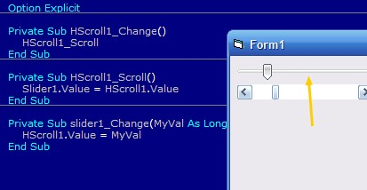



## Basic Slider Control

### Description

Do you want a small and efficient slider control for use in your applications? This custom made control is very small and does exactly what a slider does.
 
### More Info
 
Zip file 2.82kb

             |
---                |---
**Submitted On**   |2007-08-11 09:40:02
**By**             |[Brian Lai](https://github.com/Planet-Source-Code/PSCIndex/blob/master/ByAuthor/brian-lai.md)
**Level**          |Beginner
**User Rating**    |4.3 (17 globes from 4 users)
**Compatibility**  |VB 5\.0, VB 6\.0
**Category**       |[Custom Controls/ Forms/  Menus](https://github.com/Planet-Source-Code/PSCIndex/blob/master/ByCategory/custom-controls-forms-menus__1-4.md)
**World**          |[Visual Basic](https://github.com/Planet-Source-Code/PSCIndex/blob/master/ByWorld/visual-basic.md)
**Archive File**   |[Basic\_Slid2079098112007\.zip](https://github.com/Planet-Source-Code/brian-lai-basic-slider-control__1-69138/archive/master.zip)

